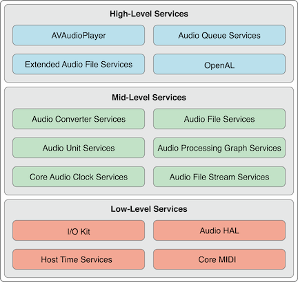
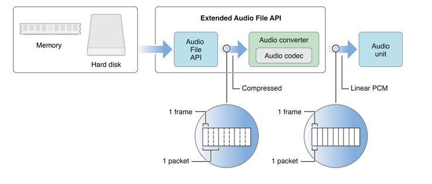

#iOS音频播放:概述
##基础
目前我们在计算机上进行音频播放都需要依赖于音频文件，音频文件的生成过程是将**声音信息采样、量化和编码**产生的数字信号的过程，人耳所能听到的声音，最低的频率是从20Hz起一直到最高频率20KHZ，因此音频文件格式的最大带宽是20KHZ。根据奈奎斯特的理论，只有采样频率高于声音信号最高频率的两倍时，才能把数字信号表示的声音还原成为原来的声音，所以音频文件的采样率一般在40~50KHZ，比如最常见的CD音质采样率44.1KHZ。

对声音进行采样，量化过程被称为缓冲编码调制(Pulse Code Modulation)，简称PCM。PCM数据是最原始的音频完全无损，所以PCM数据虽然音质优秀但体积不大，为了解决这个问题先后诞生了一系列的音频格式，这些音频格式运用不同的方法对音频数据进行压缩，其中有无损压缩(ALAC,APE,FLAC)和有损压缩(MP3,AAC,OGG,WMA)两种。

目前最为常用的音频格式是MP3，MP3是一种有损压缩的音频格式，设计这种格式的目的就是为了大幅度的减小音频的数据量，它舍弃PCM音频数据中人类听觉不敏感的部分。

MP3格式中的码率（BitRate）代表了MP3数据的压缩质量，现在常用的码率有128kbit/s、160kbit/s、320kbit/s等等，这个值越高声音质量也就越高。MP3编码方式常用的有两种固定码率(Constant bitrate，CBR)和可变码率(Variable bitrate，VBR)。

MP3格式中的数据通常由两部分组成，一部分为[ID3](http://zh.wikipedia.org/zh/ID3)用来存储歌名，演唱者，专辑，音轨数等信息，另一部分为音频数据。音频数据部分以帧(frame)为单位存储，每个音频都有自己的帧头，如图所示就是一个MP3文件帧结构图。**MP3中的每一个帧都有自己的帧头，其中存储了采样率等解码必须的信息，所以每一个帧都可以独立于文件存在和播放**，这个特性加上高压缩比使得MP3文件成为了音频流播放的主流格式。帧头之后存储着音频数据，这些音频数据是若干个PCM数据帧经过压缩算法压缩得到的，对CBR的MP3数据来说每个帧中包含的PCM数据帧是固定的，而VBR是可变的。

##iOS音频播放概述
一个经典的音频播放流程(以MP3为例):

1. 读取MP3文件
2. 解析采样率，码率，时长等信息，分离MP3中的音频帧
3. 对分离出来的音频帧解码得到PCM数据
4. 对PCM数据进行音效处理(均衡器，混响器等，非必需)
5. 把PCM数据解码成音频信号
6. 把音频信号交给硬件播放
7. 重复1-6步直到播放完成

在iOS系统中apple对上述的流程进行了封装并提供了不同层次的接口（图片引自[官方文档](https://developer.apple.com/library/ios/documentation/MusicAudio/Conceptual/CoreAudioOverview/CoreAudioEssentials/CoreAudioEssentials.html#//apple_ref/doc/uid/TP40003577-CH10-SW1)）。

* Audio File Services:读写音频数据，可以完成播放流程中的第二步；
* Audio File Stream Services:对音频进行解码，可以完成播放流程中的第二步；
* Audio Convert Services:音频数据转换，可以完成播放流程中第三步；
* Audio Processing Graph Service:音效处理模块，可以完成播放流程中的第四步；
* Audio Unit Services:播放音频数据，可以完成播放流中的第五步，第六步；
* Extended Audio File Services:Audio File Services和Audio Converter services的结合体；
* AVAudioPlayer/AVPlayer(AVFoundation)高级接口，可以完成整个音频播放的过程(包括本地文件和网络流播放，第四步除外)
* Audio Queue Serices:高级接口，可以进行录音和播放，可以完成播放流程中的第3，5，6步；
* OpenAL:用于游戏音频播放，暂部讨论；

可以看到apple提供的接口类型非常丰富，可以满足各种类别类需求：

* 如果你只是想实现音频的播放，没有其他需求AVFoundation会很好的满足你的需求。AVAudioPlayer/AVPlayer的接口使用简单、不用关心其中的细节；
* 如果你的app需要对音频进行流播放并且同时存储，那么**AudioFileStreamer加AudioQueue能够帮到你，你可以先把音频数据下载到本地，一边下载一边用NSFileHandler等接口读取本地音频文件并交给AudioFileStreamer或者AudioFile解析分离音频帧，分离出来的音频帧可以送给AudioQueue进行解码和播放。如果是本地文件直接读取文件解析即可。**（这两个都是比较直接的做法，这类需求也可以用AVFoundation+本地server的方式实现，AVAudioPlayer会把请求发送给本地server，由本地server转发出去，获取数据后在本地server中存储并转送给AVAudioPlayer。另一个比较trick的做法是先把音频下载到文件中，在下载到一定量的数据后把文件路径给AVAudioPlayer播放，当然这种做法在音频seek后就回有问题了。）；
* 如果你正在开发一个专业的音乐播放软件，需要对音频施加音效（均衡器、混响器），那么除了数据的读取和解析以外还需要用到AudioConverter来把音频数据转换成PCM数据，再由AudioUnit+AUGraph来进行音效处理和播放（但目前多数带音效的app都是自己开发音效模块来坐PCM数据的处理，这部分功能自行开发在自定义性和扩展性上会比较强一些。PCM数据通过音效器处理完成后就可以使用AudioUnit播放了，当然AudioQueue也支持直接使对PCM数据进行播放。）。下图描述的就是使用AudioFile + AudioConverter + AudioUnit进行音频播放的流程（图片引自[官方文档](https://developer.apple.com/library/ios/documentation/MusicAudio/Conceptual/CoreAudioOverview/ARoadmaptoCommonTasks/ARoadmaptoCommonTasks.html#//apple_ref/doc/uid/TP40003577-CH6-SW1)）。

