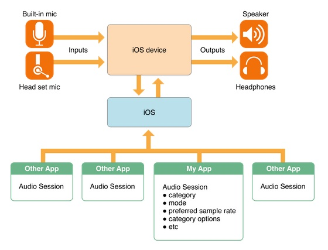
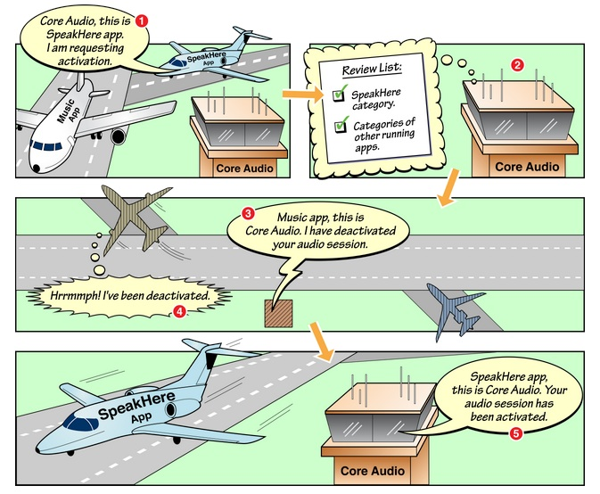

#iOS音频播放:AudioSession

##AudioSession简介
AudioSession这个玩意的主要功能包括以下几点（图片来自[官方文档](https://developer.apple.com/library/ios/documentation/Audio/Conceptual/AudioSessionProgrammingGuide/Introduction/Introduction.html#//apple_ref/doc/uid/TP40007875)）：

1. 确定你的app如何使用音频(是播放，还是录音)
2. 为你的app选择合适的输入输出设备(比如输入用的麦克风，输出是耳机，手机功放或者airplay)
3. 协调你的app的音频播放和系统以及其他的app行为(例如有电话时需要打断，电话结束时需要恢复，按下静音按钮时是否歌曲也要静音)



AudioSession相关的类有两个：

1. AudioToolBox中的AudioSession
2. AVFoundation中的AVAudioSession

其中AudioSession在SDK 7中已经被标注为depracated，而AVAudioSession这个类虽然iOS 3开始就已经存在了，但其中很多方法和变量都是在iOS 6以后甚至是iOS 7才有的。所以各位可以依照以下标准选择：

* 如果最低版本支持iOS 5，可以使用AudioSession，也可以使用AVAudioSession；
* 如果最低版本支持iOS 6及以上，请使用AVAudioSession

下面以AudioSession类为例来讲述AudioSession相关功能的使用（很不幸我需要支持iOS 5。。T-T，使用AVAudioSession的同学可以在其头文件中寻找对应的方法使用即可，需要注意的点我会加以说明）.

##初始化AudioSession

使用AudioSession类首先需要调用初始化方法：

```
extern OSStatus AudioSessionInitialize(CFRunLoopRef inRunLoop,
                                       CFStringRef inRunLoopMode,
                                       AudioSessionInterruptionListener inInterruptionListener,
                                       void *inClientData);
```

前两个参数一般填NULL表示AudioSession运行在主线程上（但并不代表音频的相关处理运行在主线程上，只是AudioSession），第三个参数需要传入一个AudioSessionInterruptionListener类型的方法，作为AudioSession被打断时的回调，第四个参数则是代表打断回调时需要附带的对象（即回到方法中的inClientData，如下所示，可以理解为UIView animation中的context）。

```
typedef void (*AudioSessionInterruptionListener)(void * inClientData, UInt32 inInterruptionState);
```
这才刚开始，坑就来了。这里会有两个问题：

第一，AudioSessionInitialize可以被多次执行，但AudioSessionInterruptionListener只能被设置一次，这就意味着这个打断回调方法是一个静态方法，一旦初始化成功以后所有的打断都会回调到这个方法，即便下一次再次调用AudioSessionInitialize并且把另一个静态方法作为参数传入，当打断到来时还是会回调到第一次设置的方法上。

这种场景并不少见，例如你的app既需要播放歌曲又需要录音，当然你不可能知道用户会先调用哪个功能，所以你必须在播放和录音的模块中都调用AudioSessionInitialize注册打断方法，但最终打断回调只会作用在先注册的那个模块中，很蛋疼吧。。。***所以对于AudioSession的使用最好的方法是生成一个类单独进行管理，统一接收打断回调并发送自定义的打断通知，在需要用到AudioSession的模块中接收通知并做相应的操作。***

Apple也察觉到了这一点，所以在AVAudioSession中首先取消了Initialize方法，改为了单例方法sharedInstance。在iOS 5上所有的打断都需要通过设置id<AVAudioSessionDelegate> delegate并实现回调方法来实现，这同样会有上述的问题，所以在iOS 5使用AVAudioSession下仍然需要一个单独管理AudioSession的类存在。在iOS 6以后Apple终于把打断改成了通知的形式。。这下科学了。

第二，AudioSessionInitialize方法的第四个参数inClientData，也就是回调方法的第一个参数。上面已经说了打断回调是一个静态方法，而这个参数的目的是为了能让回调时拿到context（上下文信息），所以这个inClientData需要是一个有足够长生命周期的对象（当然前提是你确实需要用到这个参数），如果这个对象被dealloc了，那么回调时拿到的inClientData会是一个野指针。就这一点来说构造一个单独管理AudioSession的类也是有必要的，因为这个类的生命周期和AudioSession一样长，我们可以把context保存在这个类中。


##监听RouteChange事件
如果想要实现类似于“拔掉耳机就把歌曲暂停”的功能就需要监听RouteChange事件：

```
extern OSStatus AudioSessionAddPropertyListener(AudioSessionPropertyID inID,
                                                AudioSessionPropertyListener inProc,
                                                void *inClientData);
                                              
typedef void (*AudioSessionPropertyListener)(void * inClientData,
                                             AudioSessionPropertyID inID,
                                             UInt32 inDataSize,
                                             const void * inData);
```

调用上述方法，AudioSessionPropertyID参数传kAudioSessionProperty_AudioRouteChange，AudioSessionPropertyListener参数传对应的回调方法。inClientData参数同AudioSessionInitialize方法。
同样作为静态回调方法还是需要统一管理，接到回调时可以把第一个参数inData转换成CFDictionaryRef并从中获取kAudioSession_AudioRouteChangeKey_Reason键值对应的value（应该是一个CFNumberRef），得到这些信息后就可以发送自定义通知给其他模块进行相应操作(例如kAudioSessionRouteChangeReason_OldDeviceUnavailable就可以用来做“拔掉耳机就把歌曲暂停”)。

```
//AudioSession的AudioRouteChangeReason枚举
enum {
      kAudioSessionRouteChangeReason_Unknown = 0,
      kAudioSessionRouteChangeReason_NewDeviceAvailable = 1,
      kAudioSessionRouteChangeReason_OldDeviceUnavailable = 2,
      kAudioSessionRouteChangeReason_CategoryChange = 3,
      kAudioSessionRouteChangeReason_Override = 4,
      kAudioSessionRouteChangeReason_WakeFromSleep = 6,
      kAudioSessionRouteChangeReason_NoSuitableRouteForCategory = 7,
      kAudioSessionRouteChangeReason_RouteConfigurationChange = 8
  };
```

```
//AVAudioSession的AudioRouteChangeReason枚举
typedef NS_ENUM(NSUInteger, AVAudioSessionRouteChangeReason)
{
  AVAudioSessionRouteChangeReasonUnknown = 0,
  AVAudioSessionRouteChangeReasonNewDeviceAvailable = 1,
  AVAudioSessionRouteChangeReasonOldDeviceUnavailable = 2,
  AVAudioSessionRouteChangeReasonCategoryChange = 3,
  AVAudioSessionRouteChangeReasonOverride = 4,
  AVAudioSessionRouteChangeReasonWakeFromSleep = 6,
  AVAudioSessionRouteChangeReasonNoSuitableRouteForCategory = 7,
  AVAudioSessionRouteChangeReasonRouteConfigurationChange NS_ENUM_AVAILABLE_IOS(7_0) = 8
}
```
注意：iOS 5下如果使用了AVAudioSession由于AVAudioSessionDelegate中并没有定义相关的方法，还是需要用这个方法来实现监听。iOS 6下直接监听AVAudioSession的通知就可以了。

##设置类别
下一步要设置AudioSession的Category，使用AudioSession时调用下面的接口

```
1
2
3
extern OSStatus AudioSessionSetProperty(AudioSessionPropertyID inID,
                                        UInt32 inDataSize,
                                        const void *inData);
```

如果我需要的功能是播放，执行如下代码

```
UInt32 sessionCategory = kAudioSessionCategory_MediaPlayback;
AudioSessionSetProperty (kAudioSessionProperty_AudioCategory,
                         sizeof(sessionCategory),
                         &sessionCategory);
```
使用AVAudioSession时调用下面的接口

```
/* set session category */
- (BOOL)setCategory:(NSString *)category error:(NSError **)outError;
/* set session category with options */
- (BOOL)setCategory:(NSString *)category withOptions: (AVAudioSessionCategoryOptions)options error:(NSError **)outError NS_AVAILABLE_IOS(6_0);

```
至于Category的类型在[官方文档](https://developer.apple.com/library/ios/documentation/Audio/Conceptual/AudioSessionProgrammingGuide/AudioSessionBasics/AudioSessionBasics.html#//apple_ref/doc/uid/TP40007875-CH3-SW1)中都有介绍，我这里也只罗列一下具体就不赘述了，各位在使用时可以依照自己需要的功能设置Category。

```
//AudioSession的AudioSessionCategory枚举
enum {
      kAudioSessionCategory_AmbientSound               = 'ambi',
      kAudioSessionCategory_SoloAmbientSound           = 'solo',
      kAudioSessionCategory_MediaPlayback              = 'medi',
      kAudioSessionCategory_RecordAudio                = 'reca',
      kAudioSessionCategory_PlayAndRecord              = 'plar',
      kAudioSessionCategory_AudioProcessing            = 'proc'
  };
```
```
//AudioSession的AudioSessionCategory字符串
/*  Use this category for background sounds such as rain, car engine noise, etc.  
 Mixes with other music. */
AVF_EXPORT NSString *const AVAudioSessionCategoryAmbient;
  
/*  Use this category for background sounds.  Other music will stop playing. */
AVF_EXPORT NSString *const AVAudioSessionCategorySoloAmbient;

/* Use this category for music tracks.*/
AVF_EXPORT NSString *const AVAudioSessionCategoryPlayback;

/*  Use this category when recording audio. */
AVF_EXPORT NSString *const AVAudioSessionCategoryRecord;

/*  Use this category when recording and playing back audio. */
AVF_EXPORT NSString *const AVAudioSessionCategoryPlayAndRecord;

/*  Use this category when using a hardware codec or signal processor while
 not playing or recording audio. */
AVF_EXPORT NSString *const AVAudioSessionCategoryAudioProcessing;
```
##启用
有了Category就可以启动AudioSession了，启动方法：

```
//AudioSession的启动方法
extern OSStatus AudioSessionSetActive(Boolean active);
extern OSStatus AudioSessionSetActiveWithFlags(Boolean active, UInt32 inFlags);

//AVAudioSession的启动方法
- (BOOL)setActive:(BOOL)active error:(NSError **)outError;
- (BOOL)setActive:(BOOL)active withFlags:(NSInteger)flags error:(NSError **)outError NS_DEPRECATED_IOS(4_0, 6_0);
- (BOOL)setActive:(BOOL)active withOptions:(AVAudioSessionSetActiveOptions)options error:(NSError **)outError NS_AVAILABLE_IOS(6_0);

```
启动方法调用后必须要判断是否启动成功，启动不成功的情况经常存在，例如一个前台的app正在播放，你的app正在后台想要启动AudioSession那就会返回失败。
一般情况下我们在启动和停止AudioSession调用第一个方法就可以了。但如果你正在做一个即时语音通讯app的话（类似于微信、易信）就需要注意在deactive AudioSession的时候需要使用第二个方法，inFlags参数传入kAudioSessionSetActiveFlag_NotifyOthersOnDeactivation（AVAudioSession给options参数传入AVAudioSessionSetActiveOptionNotifyOthersOnDeactivation）。当你的app deactive自己的AudioSession时系统会通知上一个被打断播放app打断结束（就是上面说到的打断回调），如果你的app在deactive时传入了NotifyOthersOnDeactivation参数，那么其他app在接到打断结束回调时会多得到一个参数kAudioSessionInterruptionType_ShouldResume否则就是ShouldNotResume（AVAudioSessionInterruptionOptionShouldResume），根据参数的值可以决定是否继续播放。

大概流程是这样的：

1. 一个音乐软件A正在播放；
2. 用户打开你的软件播放对话语音，AudioSession active
3. 音乐软件A音乐被打断并收到InterruptBegin事件；
4. 对话语音播放结束，AudioSession deactive并且传入NotifyOthersOnDeactivation参数；
5. 音乐软件A收到InterruptEnd事件，查看Resume参数，如果是ShouldResume控制音频继续播放，如果是ShouldNotResume就维持打断状态；

[官方文档](https://developer.apple.com/library/ios/documentation/Audio/Conceptual/AudioSessionProgrammingGuide/ConfiguringanAudioSession/ConfiguringanAudioSession.html#//apple_ref/doc/uid/TP40007875-CH2-SW1)中有一张很形象的图来阐述这个现象：


##打断处理
正常启动AudioSession之后就可以播放音频了，下面要讲的是对于打断的处理。之前我们说到打断的回调在iOS 5下需要统一管理，在收到打断开始和结束时需要发送自定义的通知。

使用AudioSession时打断回调应该首先获取kAudioSessionProperty_InterruptionType，然后发送一个自定义的通知并带上对应的参数。

```
static void MyAudioSessionInterruptionListener(void *inClientData, UInt32 inInterruptionState)
{
    AudioSessionInterruptionType interruptionType = kAudioSessionInterruptionType_ShouldNotResume;
    UInt32 interruptionTypeSize = sizeof(interruptionType);
    AudioSessionGetProperty(kAudioSessionProperty_InterruptionType,
                            &interruptionTypeSize,
                            &interruptionType);

    NSDictionary *userInfo = @{MyAudioInterruptionStateKey:@(inInterruptionState),
                               MyAudioInterruptionTypeKey:@(interruptionType)};

    [[NSNotificationCenter defaultCenter] postNotificationName:MyAudioInterruptionNotification object:nil userInfo:userInfo];
}

```

收到通知后的处理方法如下（注意ShouldResume参数）：

```
- (void)interruptionNotificationReceived:(NSNotification *)notification
{
    UInt32 interruptionState = [notification.userInfo[MyAudioInterruptionStateKey] unsignedIntValue];
    AudioSessionInterruptionType interruptionType = [notification.userInfo[MyAudioInterruptionTypeKey] unsignedIntValue];
    [self handleAudioSessionInterruptionWithState:interruptionState type:interruptionType];
}

- (void)handleAudioSessionInterruptionWithState:(UInt32)interruptionState type:(AudioSessionInterruptionType)interruptionType
{
    if (interruptionState == kAudioSessionBeginInterruption)
    {
        //控制UI，暂停播放
    }
    else if (interruptionState == kAudioSessionEndInterruption)
    {
        if (interruptionType == kAudioSessionInterruptionType_ShouldResume)
        {
            OSStatus status = AudioSessionSetActive(true);
            if (status == noErr)
            {
                //控制UI，继续播放
            }
        }
    }
}

```

##小结

* 如果最低版本支持iOS 5，可以使用AudioSession也可以考虑使用AVAudioSession，需要有一个类统一管理AudioSession的所有回调，在接到回调后发送对应的自定义通知；
* 如果最低版本支持iOS 6及以上，请使用AVAudioSession，不用统一管理，接AVAudioSession的通知即可；
* 根据app的应用场景合理选择Category；
* 在deactive时需要注意app的应用场景来合理的选择是否使用NotifyOthersOnDeactivation参数；
* 在处理InterruptEnd事件时需要注意ShouldResume的值。