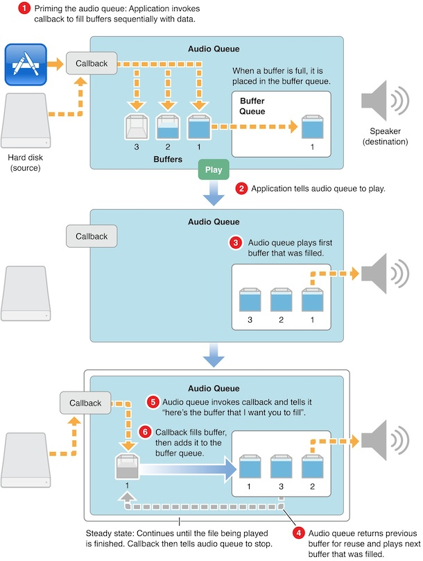

#iOS音频播放: AudioQueue
##AudioQueue介绍
AudioQueue是AudioToolBox.framework 中的一员，在[官方文档](https://developer.apple.com/library/ios/documentation/MusicAudio/Conceptual/AudioQueueProgrammingGuide/Introduction/Introduction.html#//apple_ref/doc/uid/TP40005343)中这样描述 AudioQueue的:

```
Audio Queue Services provides a straightforward, low
overhead way to record and play audio in iOS and Mac osx. It is the recommended technology to use for adding 
basic recording or playback features to you iOS or Mac os x application.
```
在文档中Apple推荐开发者使用AudioQueue来实现app中的播放和录音功能。这里我们会针对播放功能进行介绍。

对于支持的数据格式，Apple这样说：

Audio Queue Services lets you record and play audio in any of the following formats:

* Linear PCM.
* Any compressed format supported natively on the Apple platform you are developing for.
* Any other format for which a user has an installed codec.

它支持PCM数据、iOS/MacOSX平台支持的压缩格式（MP3、AAC等）、其他用户可以自行提供解码器的音频数据（对于这一条，我的理解就是把音频格式自行解码成PCM数据后再给AudioQueue播放 ）。

##AudioQueue的工作模式
在使用AudioQueue之前首先必须理解其工作模式，它之所以这么命名是因为在其内部有一套缓冲队列（Buffer Queue）的机制。在AudioQueue启动之后需要通过AudioQueueAllocateBuffer生成若干个AudioQueueBufferRef结构，这些Buffer将用来存储即将要播放的音频数据，并且这些Buffer是受生成他们的AudioQueue实例管理的，内存空间也已经被分配（按照Allocate方法的参数），当AudioQueue被Dispose时这些Buffer也会随之被销毁。

当有音频数据需要被播放时首先需要被memcpy到AudioQueueBufferRef的mAudioData中（mAudioData所指向的内存已经被分配，之前AudioQueueAllocateBuffer所做的工作），并给mAudioDataByteSize字段赋值传入的数据大小。完成之后需要调用AudioQueueEnqueueBuffer把存有音频数据的Buffer插入到AudioQueue内置的Buffer队列中。在Buffer队列中有buffer存在的情况下调用AudioQueueStart，此时AudioQueue就回按照Enqueue顺序逐个使用Buffer队列中的buffer进行播放，每当一个Buffer使用完毕之后就会从Buffer队列中被移除并且在使用者指定的RunLoop上触发一个回调来告诉使用者，某个AudioQueueBufferRef对象已经使用完成，你可以继续重用这个对象来存储后面的音频数据。如此循环往复音频数据就会被逐个播放直到结束。

[官方文档](https://developer.apple.com/library/ios/documentation/MusicAudio/Conceptual/AudioQueueProgrammingGuide/AboutAudioQueues/AboutAudioQueues.html#//apple_ref/doc/uid/TP40005343-CH5-SW9)给出了一副图来描述这一过程：

其中的callback按我的理解应该是指一个音频数据装填方法，该方法可以通过之前提到的数据使用后的回调来触发。



根据Apple提供的AudioQueue工作原理结合自己理解，可以得到其工作流程大致如下：

```
1. 创建AudioQueue，创建一个自己的buffer数组BufferArray;
2. 使用AudioQueueAllocateBuffer创建若干个AudioQueueBufferRef（一般2-3个即可），放入BufferArray；
3. 有数据时从Buffer, memcpy数据后用AudioQueueEnqueuebuffer方法把buffer插入AudioQueue中;
4. AudioQueue中存在Buffer后，调用AudioQueueStart播放。（具体等到填入多少Buffer后再播放可以自己控制，只要能保证播放不间断即可）
5. AudioQueue播放音乐后消耗了某个buffer，在另一个线程回调并送出改buffer，把BufferArray供下一次使用；
6. 返回步骤3继续循环播放结束；
```
从以上步骤其实不难看出，AudioQueue播放的过程其实就是一个典型的[生产者消费者问题](http://zh.wikipedia.org/zh/生产者消费者问题)。生产者是AudioFileStream或者AudioFile，它们生产处音频数据帧，放入到AudioQueue的buffer队列中，直到buffer填满后需要等待消费者消费；AudioQueue作为消费者，消费了buffer队列中的数据，并且在另一个线程回调通知数据已经被消费生产者可以继续生产。所以在实现AudioQueue播放音频的过程中必然会接触到一些多线程同步、信号量的使用、死锁的避免等等问题。

了解了工作流程之后再回头来看AudioQueue的方法，其中大部分方法都非常好理解，部分需要稍加解释。

##创建AudioQueue

使用下列方法来生成AudioQueue的实例

```
OSStatus AudioQueueNewOutput (const AudioStreamBasicDescription * inFormat,
                              AudioQueueOutputCallback inCallbackProc,
                              void * inUserData,
                              CFRunLoopRef inCallbackRunLoop,
                              CFStringRef inCallbackRunLoopMode,
                              UInt32 inFlags,
                              AudioQueueRef * outAQ);
                              
OSStatus AudioQueueNewOutputWithDispatchQueue(AudioQueueRef * outAQ,
                                              const AudioStreamBasicDescription * inFormat,
                                              UInt32 inFlags,
                                              dispatch_queue_t inCallbackDispatchQueue,
                                              AudioQueueOutputCallbackBlock inCallbackBlock);
```
先来看第一个方法：

第一个参数表示需要播放的音频数据格式类型，是一个AudioStreamBasicDescription对象，是使用AudioFileStream或者AudioFile解析出来的数据格式信息；

第二个参数AudioQueueOutputCallback是某块Buffer被使用之后的回调；

第三个参数为上下文对象；

第四个参数inCallbackRunLoop为AudioQueueOutputCallback需要在的哪个RunLoop上被回调，如果传入NULL的话就会再AudioQueue的内部RunLoop中被回调，所以一般传NULL就可以了；

第五个参数inCallbackRunLoopMode为RunLoop模式，如果传入NULL就相当于kCFRunLoopCommonModes，也传NULL就可以了；

第六个参数inFlags是保留字段，目前没作用，传0；

第七个参数，返回生成的AudioQueue实例；
返回值用来判断是否成功创建（OSStatus == noErr）。
第二个方法就是把RunLoop替换成了一个dispatch queue，其余参数同相同。

##Buffer相关的方法
1. 创建Buffer

```
OSStatus AudioQueueAllocateBuffer(AudioQueueRef inAQ,
                                  UInt32 inBufferByteSize,
                                  AudioQueueBufferRef * outBuffer);
                                  
OSStatus AudioQueueAllocateBufferWithPacketDescriptions(AudioQueueRef inAQ,
                                                        UInt32 inBufferByteSize,
                                                        UInt32 inNumberPacketDescriptions,
                                                        AudioQueueBufferRef * outBuffer);
```

第一个方法传入AudioQueue实例和Buffer大小，传出的Buffer实例；

第二个方法可以指定生成的Buffer中PacketDescriptions的个数；


销毁Buffer 

```
OSStatus AudioQueueFreeBuffer(AudioQueueRef inAQ,AudioQueueBufferRef inBuffer);
```
注意这个方法一般只在需要销毁特定某个buffer时才会被用到（因为dispose方法会自动销毁所有buffer），并且这个方法只能在AudioQueue不在处理数据时才能使用。所以这个方法一般不太能用到。

插入Buffer

```
OSStatus AudioQueueEnqueueBuffer(AudioQueueRef inAQ,
                                 AudioQueueBufferRef inBuffer,
                                 UInt32 inNumPacketDescs,
                                 const AudioStreamPacketDescription * inPacketDescs);
```

Enqueue方法一共有两个，上面给出的是第一个方法，第二个方法AudioQueueEnqueueBufferWithParameters可以对Enqueue的buffer进行更多额外的操作，第二个方法我也没有细细研究，一般来说用第一个方法就能满足需求了，这里我也就只针对第一个方法进行说明：

这个Enqueue方法需要传入AudioQueue实例和需要Enqueue的Buffer，对于有inNumPacketDescs和inPacketDescs则需要根据需要选择传入，文档上说这两个参数主要是在播放VBR数据时使用，但之前我们提到过即便是CBR数据AudioFileStream或者AudioFile也会给出PacketDescription所以不能如此一概而论。简单的来说就是有就传PacketDescription没有就给NULL，不必管是不是VBR。

##播放控制
`开始播放`

```
OSStatus AudioQueueStart(AudioQueueRef inAQ,const AudioTimeStamp * inStartTime);
```
第二个参数可以用来控制播放开始的时间，一般情况下直接开始播放传入NULL即可。

`解码数据`

```
OSStatus AudioQueuePrime(AudioQueueRef inAQ,
                          UInt32 inNumberOfFramesToPrepare,
                          UInt32 * outNumberOfFramesPrepared);    
```
这个方法并不常用，因为直接调用AudioQueueStart会自动开始解码（如果需要的话）。参数的作用是用来指定需要解码帧数和实际完成解码的帧数；

`暂停播放`

```
OSStatus AudioQueuePause(AudioQueueRef inAQ);
```
需要注意的是这个方法一旦调用后播放就会立即暂停，这就意味着AudioQueueOutputCallback回调也会暂停，这时需要特别关注线程的调度以防止线程陷入无限等待。

`停止播放`
```
OSStatus AudioQueueStop(AudioQueueRef inAQ, Boolean inImmediate);
```

第二个参数如果传入true的话会立即停止播放（同步），如果传入false的话AudioQueue会播放完已经Enqueue的所有buffer后再停止（异步）。使用时注意根据需要传入适合的参数。

`Flush`

```
OSStatus
AudioQueueFlush(AudioQueueRef inAQ);
```

调用后会播放完Enqueu的所有buffer后重置解码器状态，以防止当前的解码器状态影响到下一段音频的解码（比如切换播放的歌曲时）。如果和AudioQueueStop(AQ,false)一起使用并不会起效，因为Stop方法的false参数也会做同样的事情。

`重置 `
```
OSStatus AudioQueueReset(AudioQueueRef inAQ);
```

重置AudioQueue会清除所有已经Enqueue的buffer，并触发AudioQueueOutputCallback,调用AudioQueueStop方法时同样会触发该方法。这个方法的直接调用一般在seek时使用，用来清除残留的buffer（seek时还有一种做法是先AudioQueueStop，等seek完成后重新start）。

`获取播放时间`

```
OSStatus AudioQueueGetCurrentTime(AudioQueueRef inAQ,
                                  AudioQueueTimelineRef inTimeline,
                                  AudioTimeStamp * outTimeStamp,
                                  Boolean * outTimelineDiscontinuity);
```
传入的参数中，第一、第四个参数是和AudioQueueTimeline相关的我们这里并没有用到，传入NULL。调用后的返回AudioTimeStamp，从这个timestap结构可以得出播放时间，计算方法如下：

```
AudioTimeStamp time = ...; //AudioQueueGetCurrentTime方法获取
NSTimeInterval playedTime = time.mSampleTime / _format.mSampleRate;
```
在使用这个时间获取方法时有两点必须注意：

1、 第一个需要注意的时这个播放时间是指实际播放的时间和一般理解上的播放进度是有区别的。举个例子，开始播放8秒后用户操作slider把播放进度seek到了第20秒之后又播放了3秒钟，此时通常意义上播放时间应该是23秒，即播放进度；而用GetCurrentTime方法中获得的时间为11秒，即实际播放时间。所以每次seek时都必须保存seek的timingOffset：

```
AudioTimeStamp time = ...; //AudioQueueGetCurrentTime方法获取
NSTimeInterval playedTime = time.mSampleTime / _format.mSampleRate; //seek时的播放时间

NSTimeInterval seekTime = ...; //需要seek到哪个时间
NSTimeInterval timingOffset = seekTime - playedTime;
```
seek后的播放进度需要根据timingOffset和playedTime计算：

```
NSTimeInterval progress = timingOffset + playedTime;
```
2、 第二个需要注意的是GetCurrentTime方法有时候会失败，所以上次获取的播放时间最好保存起来，如果遇到调用失败，就返回上次保存的结果。

##销毁AudioQueue
```
AudioQueueDispose(AudioQueueRef inAQ,  Boolean inImmediate);
```
销毁的同时会清除其中所有的buffer，第二个参数的意义和用法与AudioQueueStop方法相同。

这个方法使用时需要注意当AudioQueueStart调用之后AudioQueue其实还没有真正开始，期间会有一个短暂的间隙。如果在AudioQueueStart调用后到AudioQueue真正开始运作前的这段时间内调用AudioQueueDispose方法的话会导致程序卡死。这个问题是我在使用AudioStreamer时发现的，在iOS 6必现（iOS 7我倒是没有测试过，当时发现问题时iOS 7还没发布），起因是由于AudioStreamer会在音频EOF时就进入Cleanup环节，Cleanup环节会flush所有数据然后调用Dispose，那么当音频文件中数据非常少时就有可能出现AudioQueueStart调用之时就已经EOF进入Cleanup，此时就会出现上述问题。

要规避这个问题第一种方法是做好线程的调度，保证Dispose方法调用一定是在每一个播放RunLoop之后（即至少是一个buffer被成功播放之后）。第二种方法是监听kAudioQueueProperty_IsRunning属性，这个属性在AudioQueue真正运作起来之后会变成1，停止后会变成0，所以需要保证Start方法调用后Dispose方法一定要在IsRunning为1时才能被调用。

##属性和参数
和其他的AudioToolBox类一样，AudioToolBox有很多参数和属性可以设置、获取、监听。以下是相关的方法，这里就不再一一赘述：

```
//参数相关方法
AudioQueueGetParameter
AudioQueueSetParameter

//属性相关方法
AudioQueueGetPropertySize
AudioQueueGetProperty
AudioQueueSetProperty

//监听属性变化相关方法
AudioQueueAddPropertyListener
AudioQueueRemovePropertyListener
```

属性和参数的列表：

```
//属性列表
enum { // typedef UInt32 AudioQueuePropertyID
    kAudioQueueProperty_IsRunning               = 'aqrn',       // value is UInt32

    kAudioQueueDeviceProperty_SampleRate        = 'aqsr',       // value is Float64
    kAudioQueueDeviceProperty_NumberChannels    = 'aqdc',       // value is UInt32
    kAudioQueueProperty_CurrentDevice           = 'aqcd',       // value is CFStringRef

    kAudioQueueProperty_MagicCookie             = 'aqmc',       // value is void*
    kAudioQueueProperty_MaximumOutputPacketSize = 'xops',       // value is UInt32
    kAudioQueueProperty_StreamDescription       = 'aqft',       // value is AudioStreamBasicDescription

    kAudioQueueProperty_ChannelLayout           = 'aqcl',       // value is AudioChannelLayout
    kAudioQueueProperty_EnableLevelMetering     = 'aqme',       // value is UInt32
    kAudioQueueProperty_CurrentLevelMeter       = 'aqmv',       // value is array of AudioQueueLevelMeterState, 1 per channel
    kAudioQueueProperty_CurrentLevelMeterDB     = 'aqmd',       // value is array of AudioQueueLevelMeterState, 1 per channel

    kAudioQueueProperty_DecodeBufferSizeFrames  = 'dcbf',       // value is UInt32
    kAudioQueueProperty_ConverterError          = 'qcve',       // value is UInt32

    kAudioQueueProperty_EnableTimePitch         = 'q_tp',       // value is UInt32, 0/1
    kAudioQueueProperty_TimePitchAlgorithm      = 'qtpa',       // value is UInt32. See values below.
    kAudioQueueProperty_TimePitchBypass         = 'qtpb',       // value is UInt32, 1=bypassed
};

//参数列表
enum    // typedef UInt32 AudioQueueParameterID;
{
    kAudioQueueParam_Volume         = 1,
    kAudioQueueParam_PlayRate       = 2,
    kAudioQueueParam_Pitch          = 3,
    kAudioQueueParam_VolumeRampTime = 4,
    kAudioQueueParam_Pan            = 13
};

```

其中比较有价值的属性有：

* kAudioQueueProperty_IsRunning监听它可以知道当前AudioQueue是否在运行，这个参数的作用在讲到AudioQueueDispose时已经提到过。
* kAudioQueueProperty_MagicCookie部分音频格式需要设置magicCookie，这个cookie可以从AudioFileStream和AudioFile中获取。

比较有价值的参数有：

* kAudioQueueParam_Volume，它可以用来调节AudioQueue的播放音量，注意这个音量是AudioQueue的内部播放音量和系统音量相互独立设置并且最后叠加生效。
* kAudioQueueParam_VolumeRampTime参数和Volume参数配合使用可以实现音频播放淡入淡出的效果；
* kAudioQueueParam_PlayRate参数可以调整播放速率；

由于audioqueue不能单独demo，在下一节有demo。


